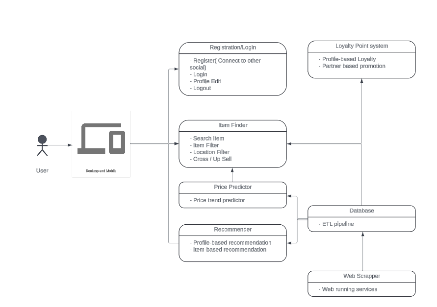

# DiscountMate Application

DiscountMate(DM) is designed to assist consumers(households) save hundreds of dollars in their grocery shopping. DM will give customers access to information about discounts from different retailers. Additionally, DM will predict future discounts on items. The application will collect data from running web scrapping and apply machine learning methods to predict the discount patterns.
Short term goal is to develop an application with must have features. Long term goal is to explore and include more features by utilizing the consumer database that is being created.

## Components

DiscountMate is built using the following technologies:

- [MongoDB](https://www.mongodb.com/)
- [Node.js](https://nodejs.org/)

## Data Collection

Web scrapping is used to collect data from various supermarkets chain such as Coles, Woolies and others.

# GitHub Guidelines

### 1. Branch Structure and Naming Convention
Branch naming conventions and hierarchy are crucial to keeping the repository organized and accessible.

#### Main Branches:
Each main team (Backend, Data, Scraping, Documentation) maintains a primary branch that stems directly from `main`.

**Branch Names**:
- `backend`
- `data`
- `scraping`
- `documentation`

#### Feature Branches:
Individual team members create their own branches for specific features or tasks. These branches should stem from their respective team's main branch.

**Format**: `{team-name}/{username}-{feature-description}`

**Example**:
- `backend/john-add-login`
- `data/amy-data-cleanup`
- `scraping/tom-fix-url-extraction`
- `documentation/sara-update-readme`

### 2. Pull Requests (PRs)
- **Creation**: When a feature is completed, the developer creates a PR to merge their feature branch back into their team's main branch.
- **Description**: Include details about the changes, why they were made, and any other relevant information.
- **Reviewer**: Assign the PR to one or more team members for review.

### 3. Trimester Branch Creation and Merging
At the end of each trimester, the team leader is responsible for creating a specific branch to consolidate all changes from the team branch before merging to the main branch.

#### Trimester Branch:
**Format**: `{team-name}/trimester-{number}`

**Example**:
- `backend/trimester-1`
- `data/trimester-1`
- `scraping/trimester-1`
- `documentation/trimester-1`

#### Merging to Main:
- **Pull Request**: The team leader creates a PR from the trimester branch to the `main` branch.
- **Review Process**: This PR must be reviewed by other team leaders or designated reviewers to ensure cross-team compatibility and adherence to overall project goals.

### 4. Conflict Resolution
- Team members should regularly update their feature branches with changes from their team's main branch to minimize conflicts.
- Conflicts within PRs should be resolved by the developer, potentially with help from the team leader if needed.
