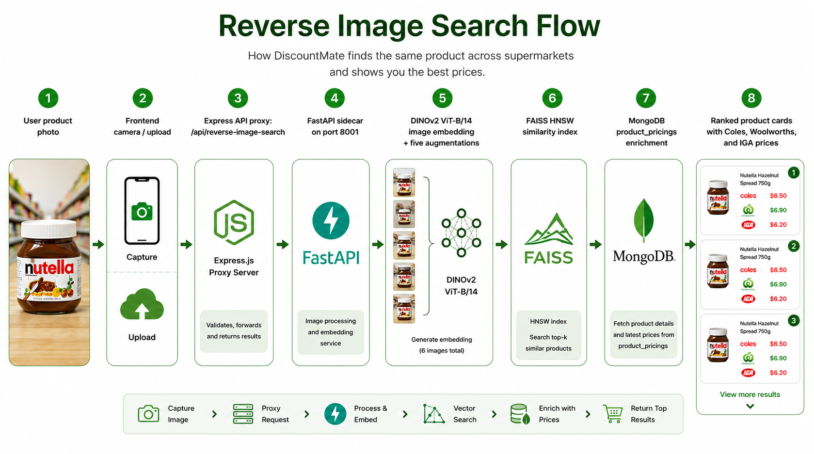
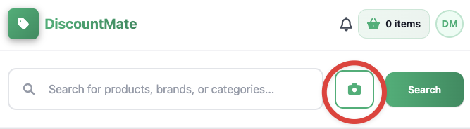
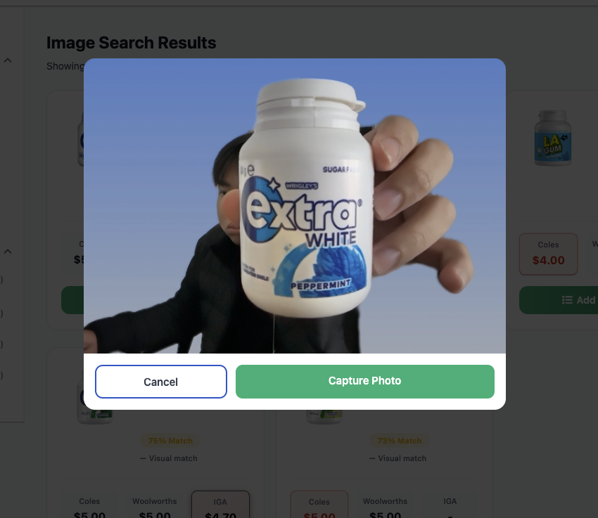
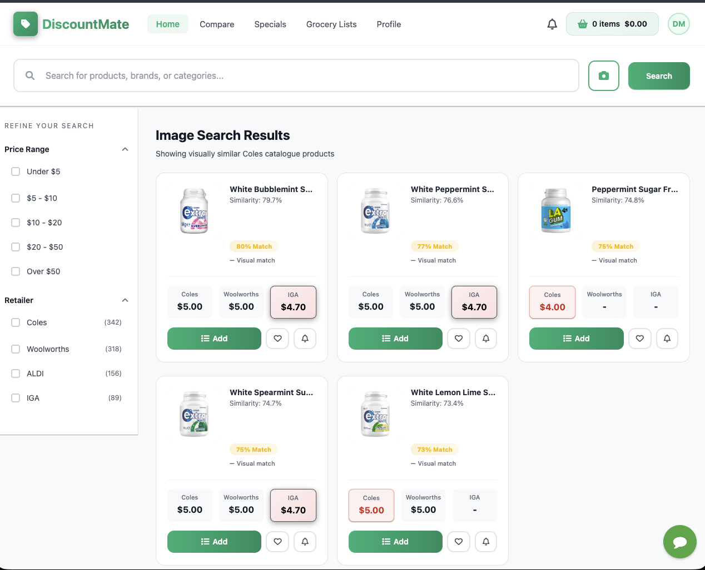

# Reverse Image Search

Reverse Image Search lets a DiscountMate user search for a grocery product by using a photo instead of typing a product name. For example, a user can take a photo of a packet, bottle, or box, and DiscountMate returns products that look visually similar.

This feature is useful when the user has the product in front of them but does not know the exact name, brand, or spelling to search for.



## What This Feature Does

At a high level, the feature does three things:

1. It accepts an uploaded product image from the frontend.
2. It compares that image against a catalogue of stored product images.
3. It returns the closest matching products with available store prices.

The current visual search index is built from **Coles catalogue images**. Woolworths and IGA are not used for image matching yet, but their prices can still appear when matching pricing data exists in MongoDB.

## How The User Uses It

### Step 1: Click The Camera Button

The user starts from the search bar. Instead of typing a product name, they click the camera button next to the search input.



### Step 2: Capture Or Upload A Product Photo

The user can take a new photo with the camera or choose an existing product image from their device. A clear front-facing product photo usually gives better results.



After the user confirms the image, the frontend uploads it to the backend endpoint:

```http
POST /api/reverse-image-search?top_k=5
```

### Step 3: View The Image Search Results

The backend sends the image to the Python reverse image search service, gets the visual matches, adds available prices, and returns the ranked products to the frontend.



Each result card can show:

- Product name
- Product image
- Visual similarity score
- Coles price
- Woolworths price, if available
- IGA price, if available

## How It Works

The system has several layers. Each layer has one job.

```text
Frontend
  -> Express backend
  -> FastAPI reverse image search sidecar
  -> DINOv2 image embedding model
  -> FAISS vector index
  -> MongoDB price enrichment
  -> Frontend product cards
```

### 1. Frontend Upload

The frontend camera button is in:

```text
Frontend/components/layout/SearchBar.tsx
```

The frontend sends the selected image to:

```http
POST /api/reverse-image-search?top_k=5
```

The frontend normally asks for the top 5 image matches.

### 2. Express Backend Proxy

The Express route is in:

```text
Backend/src/routers/reverse-image-search.router.js
```

The Express backend receives the uploaded image, checks that it is an image file, and forwards it to the Python FastAPI service.

The Express upload limit is:

```text
8 MB
```

### 3. FastAPI Sidecar

The Python reverse image search service is in:

```text
Backend/ml-service/reverse_image_search/
```

Important files:

| File | Purpose |
| --- | --- |
| `api.py` | Defines the FastAPI upload endpoint and health check. |
| `notebook_runtime.py` | Loads the AI model, FAISS index, metadata, and performs search. |

The service runs on:

```text
http://127.0.0.1:8001
```

The main endpoint is:

```http
POST /reverse-image-search?top_k=5
```

The FastAPI upload limit is:

```text
10 MB
```

### 4. DINOv2 Embeddings

The AI model used is:

```text
DINOv2 ViT-B/14
```

DINOv2 converts each product image into a list of numbers called an **embedding**. In this project, each embedding has:

```text
768 dimensions
```

A junior-friendly way to think about it:

> The model turns an image into a numerical fingerprint. Similar-looking product images should have similar fingerprints.

### 5. Image Augmentations

Before searching, the service creates five versions of the uploaded image:

| Version | What it means |
| --- | --- |
| `normal` | The original uploaded image. |
| `blur` | A slightly blurred version. |
| `saturate` | A version with stronger colour saturation. |
| `flipped` | A horizontally flipped version. |
| `centre_zoom` | A zoomed-in centre crop. |

This helps the search work better when the uploaded photo has different lighting, blur, angle, or framing.

### 6. FAISS Vector Search

The project uses **FAISS** to search quickly through many product image embeddings.

FAISS does not compare raw images directly. Instead, it compares the DINOv2 embeddings. The service searches for product embeddings that are closest to the uploaded image embedding.

The current index type is:

```text
FAISS HNSW
```

The FAISS index file is expected at:

```text
Backend/ml-service/ml_models/reverse_image_search.faiss
```

The metadata file is expected at:

```text
Backend/ml-service/ml_models/reverse_image_search_metadata.json
```

The metadata connects FAISS results back to real product information such as product name, MongoDB ID, product code, image URL, and store prices.

### 7. MongoDB Price Enrichment

After the FastAPI service finds visually similar products, Express enriches the results with live prices from MongoDB.

The pricing collection is:

```text
product_pricings
```

Store chains used:

| Store | MongoDB store chain |
| --- | --- |
| Coles | `coles_generic` |
| Woolworths | `woolworths_generic` |
| IGA | `iga_generic` |

If MongoDB is unavailable, the backend still returns visual search results, but some prices may be missing.

## How To Set Up Reverse Image Search

These steps assume you are working from the project root.

### 1. Install Backend Dependencies

Install Node dependencies for the Express backend:

```bash
cd Backend
npm install
```

### 2. Install Python ML Dependencies

Create and activate a Python virtual environment inside `Backend/ml-service`:

```bash
cd Backend/ml-service
python3 -m venv venv
source venv/bin/activate
pip install --upgrade pip
pip install -r requirements.txt
```

On Windows, activate the virtual environment with:

```bash
venv\Scripts\activate
```

### 3. Check The Required Model Files

Reverse Image Search needs both files below:

```text
Backend/ml-service/ml_models/reverse_image_search.faiss
Backend/ml-service/ml_models/reverse_image_search_metadata.json
```

If the FAISS file is not already available locally, the runtime can download it from Google Cloud Storage when the GCS environment variables are configured.

You can also generate a new FAISS file yourself. Follow the instructions in [Building A New FAISS Index](#building-a-new-faiss-index), then place the generated files in `Backend/ml-service/ml_models`.

### 4. Configure Environment Variables

The most useful environment variables are:

| Variable | Purpose |
| --- | --- |
| `RIS_PYTHON` | Python executable used to start the sidecar. Useful if the backend cannot find the correct virtual environment. |
| `REVERSE_IMAGE_SEARCH_SERVICE_URL` | URL of the FastAPI service. Defaults to `http://localhost:8001`. |
| `LOCAL_FAISS_PATH` | Optional path to a local FAISS index file. |
| `FAISS_BUCKET_NAME` | GCS bucket containing the FAISS index. Defaults to `discountmate-ml-models`. |
| `FAISS_OBJECT_NAME` | GCS object name. Defaults to `reverse_image_search.faiss`. |
| `FAISS_GCP_PROJECT` | GCP project for local GCS access. |
| `FAISS_QUOTA_PROJECT` | Optional quota project for GCS credentials. |

For local development, if the virtual environment is inside `Backend/ml-service/venv`, the backend should find it automatically. If it does not, set `RIS_PYTHON` in `Backend/.env`.

Example:

```env
RIS_PYTHON=./ml-service/venv/bin/python
REVERSE_IMAGE_SEARCH_SERVICE_URL=http://localhost:8001
```

### 5. Start The Backend

Start the Express backend:

```bash
cd Backend
node server.js
```

When `node server.js` starts, it also starts the FastAPI reverse image search sidecar automatically.

The startup order is:

1. Express loads environment variables.
2. Express connects to MongoDB.
3. Express starts the reverse image search sidecar.
4. Express checks `http://127.0.0.1:8001/health`.
5. Express starts the API server.

### 6. Test The Health Endpoint

Once the backend is running, test:

```bash
curl http://localhost:8080/api/reverse-image-search/health
```

If your backend uses port `3000`, use:

```bash
curl http://localhost:3000/api/reverse-image-search/health
```

Expected response:

```json
{ "status": "ok" }
```

### 7. Test Uploading An Image

You can test the Express endpoint with:

```bash
curl -X POST "http://localhost:8080/api/reverse-image-search?top_k=5" \
  -F "file=@/path/to/product-image.jpg"
```

Use port `3000` instead of `8080` if your backend is configured that way.

## Building A New FAISS Index

There is also a research and index-building folder at:

```text
ML/ReverseImageSearch/
```

This folder is useful when you want to understand how the image search was researched or when you need to build a new FAISS index.

The notebooks in this folder are heavy. Use **Google Colab with an A100 GPU** when running `build_faiss_index.ipynb` or `coles_reverse_image_search_Official_investigation.ipynb`. The build notebook is designed around A100 settings such as large inference batches, bfloat16, `torch.compile`, TF32 matrix operations, and parallel image downloads. Running the full build on a normal laptop CPU or a small GPU will be very slow and may run out of memory.

Important files:

| File | Purpose |
| --- | --- |
| `build_faiss_index.ipynb` | Production-style notebook used to build a new FAISS index file and metadata. |
| `coles_reverse_image_search_Official_investigation.ipynb` | Research notebook showing the investigation and experiments behind the reverse image search approach. |
| `README.md` | Extra notes about the experimental reverse image search setup. |
| `Scraped_images/` | Local scraped product images used by the earlier experimental workflow. |
| `index.faiss` / `metadata.json` | Example or generated FAISS artifacts from the ML research workflow. |

Use `build_faiss_index.ipynb` when the product catalogue changes and the image index needs to be rebuilt. That notebook creates embeddings for product images, builds the FAISS index, and writes metadata that maps index entries back to product records.

Use `coles_reverse_image_search_Official_investigation.ipynb` when you want to understand the research process, model choices, experiments, and reasoning behind the implementation.

Before running the build notebook in Colab:

1. Choose `Runtime -> Change runtime type -> A100 GPU`.
2. Add the `MONGO_URI` secret in Colab.
3. Run the notebook from top to bottom.

After building a new production index, place or upload the generated artifacts so the backend runtime can access them:

```text
Backend/ml-service/ml_models/reverse_image_search.faiss
Backend/ml-service/ml_models/reverse_image_search_metadata.json
```

Alternatively, upload the FAISS index to the configured GCS bucket and keep the metadata file in `Backend/ml-service/ml_models`.

## API Response Example

The API returns a list of ranked products:

```json
[
  {
    "rank": 1,
    "product_id": "coles_product_code_or_mongo_id",
    "mongo_id": "696f71506b7787e691e7f411",
    "name": "Example Product Name",
    "similarity_score": 0.82,
    "image_url": "https://shop.coles.com.au/wcsstore/Coles-CAS/images/example.jpg",
    "price_now": "$4.50",
    "price_was": null,
    "price_comparable": null,
    "woolworths_price": "$4.80",
    "iga_price": null
  }
]
```

## Common Problems

| Problem | What to check |
| --- | --- |
| Backend fails while starting | Check that MongoDB environment variables are correct and the reverse image search metadata file exists. |
| Sidecar does not become healthy | Check Python dependencies, `RIS_PYTHON`, and whether DINOv2/FAISS can load. |
| FAISS index cannot load | Check that the index exists locally or GCS access is configured. |
| Search returns no results | Check that the FAISS index is not empty and that the metadata matches the index. |
| Prices are missing | Check `product_pricings` records and product code matching. |
| Upload returns 400 | Check that the file is an image and the `file` form field is used. |
| Upload returns 413 | The uploaded image is too large. |

## Current Limitations

- Visual matching currently uses the Coles product image catalogue.
- Woolworths and IGA prices are added only after a Coles visual match is found.
- Woolworths and IGA product images are not part of the current FAISS image index.
- The FAISS index must be rebuilt when the catalogue changes significantly.
- The first startup can be slow because the model and index need to load.
- Missing prices are shown as missing data, not predicted prices.
