# GitHub Guidelines

Use this workflow when contributing to DiscountMate through a fork and pull request.

## 1. Fork and clone the repository

### Step 1: Fork the repository

Open the main repository in GitHub and click **Fork**.

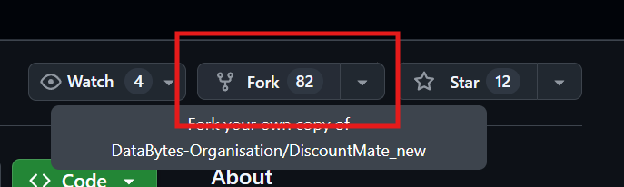

GitHub will ask where to create the fork.

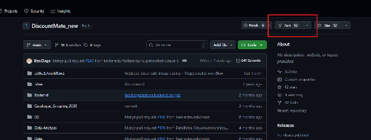

Review the fork details before creating it.

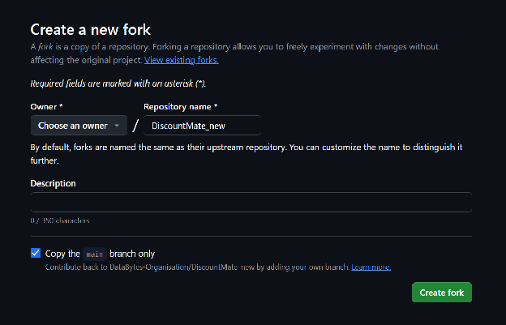

The fork can be renamed in your own GitHub account. The important part is that pull requests target the main DiscountMate repository and the `main` branch.

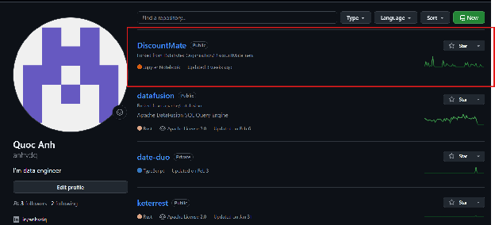

### Step 2: Clone your fork

Open your forked repository and copy the GitHub clone URL.

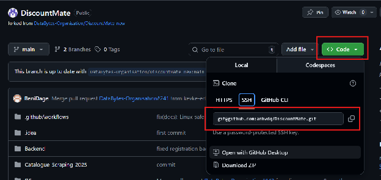

Clone the repository locally:

```bash
git clone <your-fork-url>
cd DiscountMate
```

## 2. Development workflow

### Step 1: Sync your local `main`

Before starting development, make sure your fork and local `main` branch are up to date.

In GitHub, use **Sync fork** on your fork when it is behind the upstream repository.

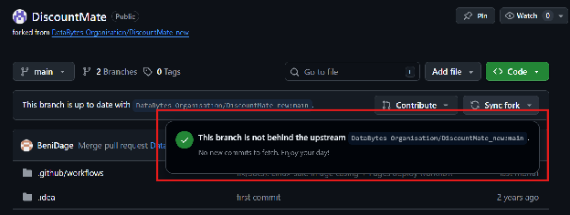

Locally:

```bash
git checkout main
git pull
git status
```

`git status` only checks your local working tree. It does not fetch remote changes, so run `git pull` or `git fetch` before trusting that your branch is current.

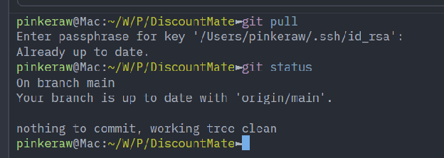

### Step 2: Create a feature branch

Create a branch from the updated `main` branch:

```bash
git checkout -b <your-branch-name>
```

Use a short branch name that describes the change, for example:

```bash
git checkout -b docs/data-engineering-guides
```

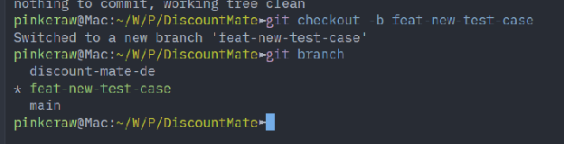

### Step 3: Develop and commit

Check changed files regularly:

```bash
git status
```

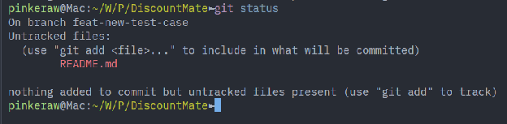

Review the actual diff before committing:

```bash
git diff
```

Stage only the files that belong in the pull request:

```bash
git add path/to/file
```

You can stage everything with `git add .`, but check `git status` afterwards to avoid committing generated files, secrets, local configs, or unrelated work.

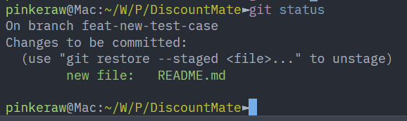

Create a commit with a clear message:

```bash
git commit -m "docs: add data engineering guides"
```

The first line of the commit message is often used as the pull request title, so keep it specific and readable.

Prefer [Conventional Commits](https://www.conventionalcommits.org/en/v1.0.0/) where practical.

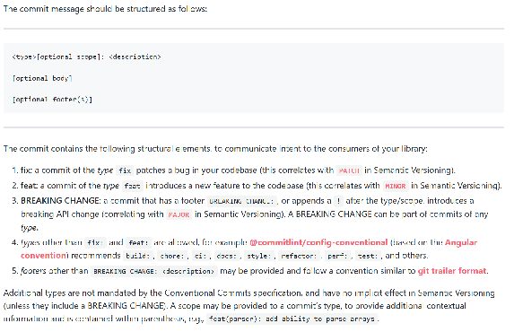

Common commit types:

| Type | Use for |
|---|---|
| `feat` | New user-facing functionality. |
| `fix` | Bug fixes. |
| `docs` | Documentation-only changes. |
| `refactor` | Code changes that do not alter behavior. |
| `test` | Test additions or updates. |
| `chore` | Tooling, maintenance, or repository housekeeping. |

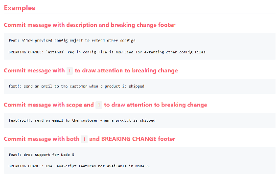

## 3. Create a pull request

### Step 1: Push your branch

Push the branch to your fork:

```bash
git push origin <your-branch-name>
```

GitHub should then show an option to compare and open a pull request.

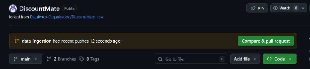

Click **Compare & pull request** and review the pull request target.

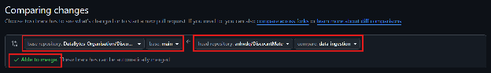

Check these details before continuing:

- The base repository is the main DiscountMate repository.
- The base branch is `main`.
- The head repository is your fork.
- The head branch is your feature branch.
- GitHub says the branch can merge cleanly, or you have resolved any conflicts.

### Step 2: Write the pull request description

GitHub will show the pull request form after the comparison screen.

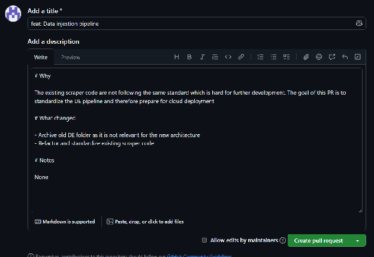

Use Markdown and include enough context for reviewers.

Recommended structure:

```markdown
## Why
Explain the problem, goal, or reason for the change.

## What changed
- Summarize the main changes.
- Mention important files or behavior changes.

## Testing
- List commands you ran.
- Note anything you could not test.

## Notes
Mention migrations, secrets, external dependencies, deployment steps, or follow-up work.
```

Preview the rendered Markdown before creating the pull request.

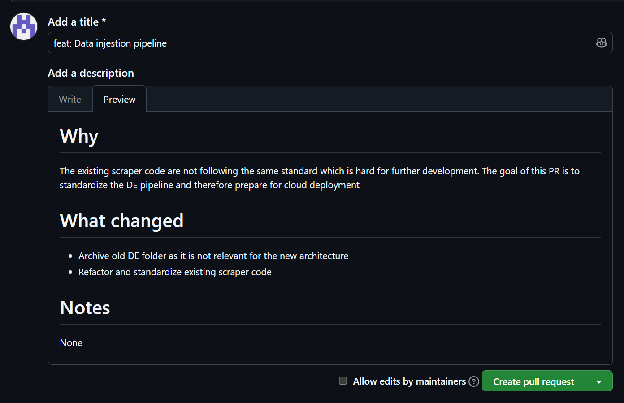

### Step 3: Create a draft or ready pull request

Create a draft pull request when the change is still in progress but you want early feedback or continuous integration results.

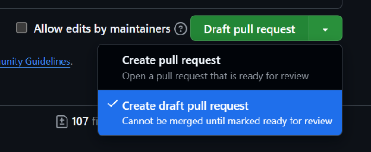

Here is an example of a draft pull request.

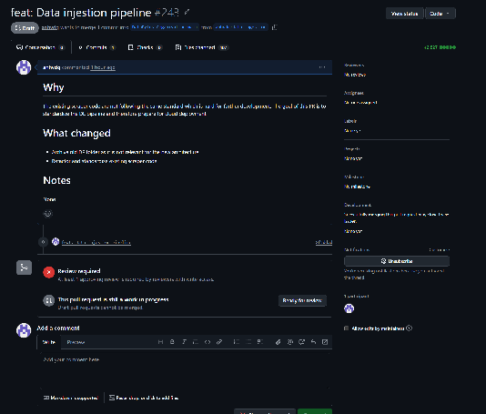

When the work is complete:

1. Rebase or merge the latest `main` branch if needed.
2. Run the relevant checks.
3. Update the pull request description.
4. Mark the pull request as ready for review.
5. Ask a maintainer or teammate to review it.

## 4. Before requesting review

Use this checklist before marking a pull request as ready:

- The branch is based on the latest `main`.
- The pull request contains only related changes.
- Generated files, secrets, `.env` files, and local config files are excluded.
- Relevant tests, builds, or documentation checks have been run.
- The pull request description explains why the change exists and how it was tested.
