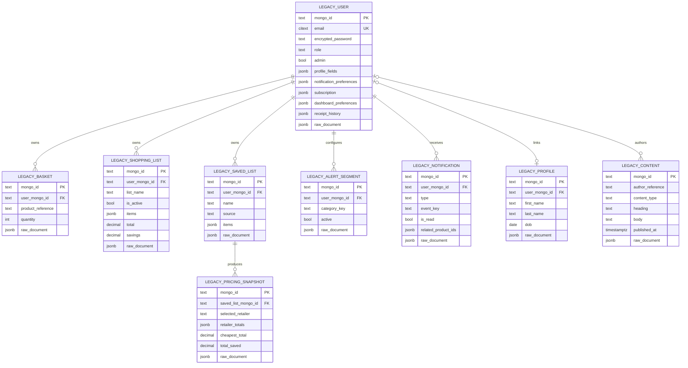
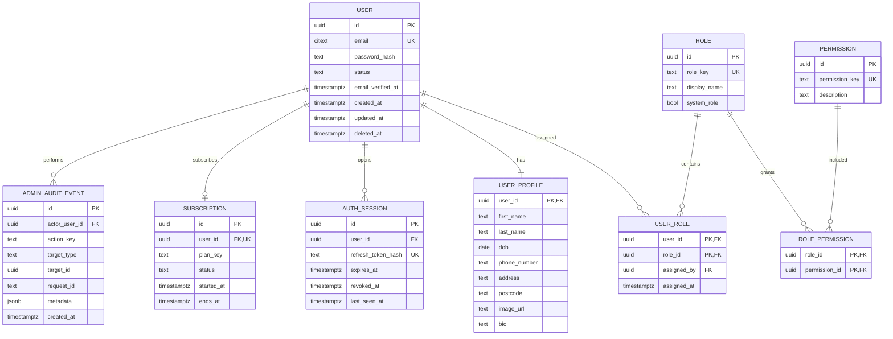
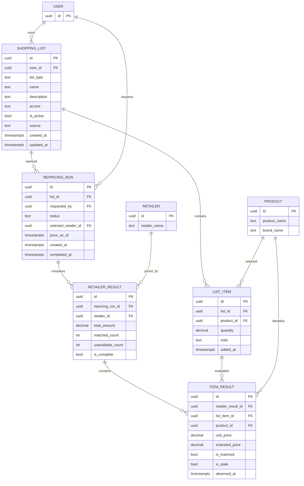
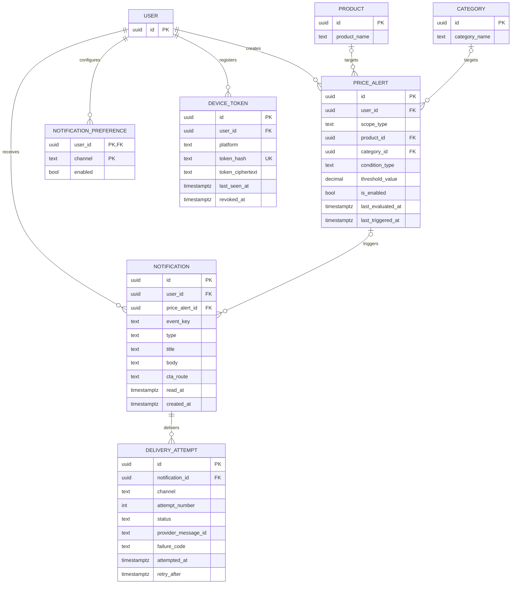
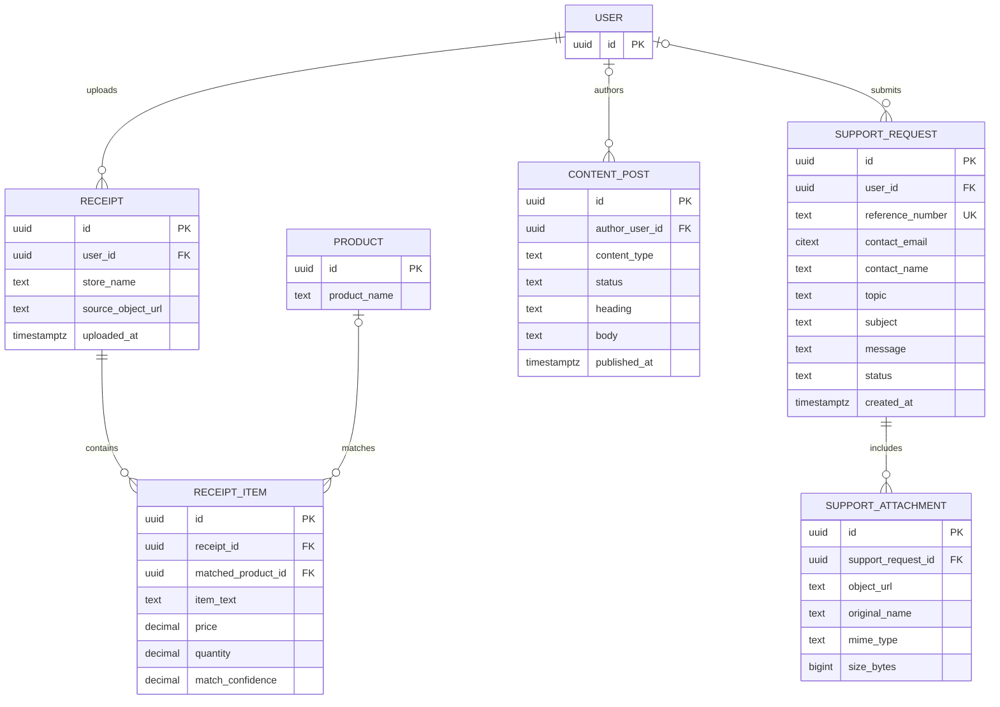

# App Dev PostgreSQL Migration and Target Schema Design

Date: 2 August 2026
Status: Approved design direction; ready for team review

## 1. Purpose

DiscountMate currently stores application-owned data in MongoDB while the Data Engineering team maintains the updated product and pricing warehouse in PostgreSQL under the `silver` schema. This design compares two possible App Dev PostgreSQL schemas:

1. a strict MongoDB-parity model for low-risk migration and reconciliation; and
2. a normalized, production-ready model supporting current data plus planned authentication, RBAC, sessions, auditing, list repricing, price alerts, delivery tracking, and mobile device tokens.

The recommended migration uses both models in sequence. The parity model is temporary; the production-ready `app` schema is the final system of record.

## 2. Ownership boundary

### Data Engineering owns

- `silver.dim_products`
- `silver.dim_categories`
- `silver.dim_retailers`
- `silver.fct_product_prices`
- retailer ingestion, canonical product matching, price history, prediction fields, and product classification

App Dev receives read access to these tables and does not create duplicate product, category, retailer, or price-history tables.

### App Dev owns

- identities, profiles, authentication sessions, roles, and permissions
- subscriptions and user preferences
- baskets, saved lists, list items, and repricing results
- price and category alerts
- notifications, preferences, push-device registrations, and delivery attempts
- receipt history
- blogs, news, and support requests
- administrative audit events

### Required cross-team contract

The UUIDs in `silver.dim_products`, `silver.dim_categories`, and `silver.dim_retailers` must remain stable across ETL refreshes. App Dev foreign keys depend on those identifiers. DE migrations must not truncate and reseed these dimensions with new UUIDs.

## 3. Why migrate the remaining MongoDB data

| Current issue | PostgreSQL outcome |
|---|---|
| Ownership appears as `user_id`, `userId`, `email`, `user_email`, and `userEmail` | One typed `user_id UUID` foreign key |
| Product references mix Mongo `ObjectId`, strings, numeric codes, and legacy IDs | One `product_id UUID` referencing `silver.dim_products` |
| Basket, `shopping_lists`, and `saved_lists` overlap | One list aggregate with normalized list items |
| Embedded arrays make item-level constraints and reporting difficult | Child tables enforce quantity, uniqueness, and ownership rules |
| MongoDB relationships are application conventions | Foreign keys prevent orphaned records |
| Multi-document writes can partially succeed | Transactions protect list, repricing, and delivery workflows |
| RBAC is represented mainly by a role string and legacy admin flag | Normalized roles, permissions, assignments, sessions, and audit events |
| Notification delivery attempts are not modeled | Retryable, inspectable delivery-attempt records |
| Optional fields and identifier variants complicate API behavior | Check constraints, unique constraints, and consistent timestamps |
| App and DE product data can drift | App tables reference the DE canonical dimensions directly |

The migration is not only a database replacement. It establishes a single relational contract for web, mobile, backend, analytics, and security work.

## 4. Compared approaches

### Approach A: MongoDB-parity PostgreSQL only

This is the fastest permanent replacement. Each current MongoDB collection becomes a similarly shaped PostgreSQL table, and embedded arrays remain `JSONB`.

Benefits:

- simplest source-to-target mapping
- fastest count and field reconciliation
- lowest initial API refactoring cost

Costs:

- retains duplicate list concepts and ownership fields
- retains JSON-heavy business data and legacy identifiers
- provides limited relational integrity
- does not fully support planned RBAC, session, audit, alert-delivery, or repricing requirements

This option is suitable as a temporary landing model but is not recommended as the production destination.

### Approach B: Direct normalized migration

MongoDB data is transformed directly into the final `app` schema.

Benefits:

- no temporary parity tables
- fastest route to the final architecture when all mapping rules are already proven

Costs:

- source-versus-target reconciliation is harder
- mapping errors are mixed with schema-transformation errors
- rollback and repeated staging runs are more complex
- legacy identifier conflicts can block the whole migration

This option is clean but creates unnecessary big-bang migration risk.

### Approach C: parity landing plus normalized target — recommended

MongoDB is first copied into `app_legacy` with source identifiers and raw values preserved. Repeatable transformations then populate the final `app` schema. Reconciliation occurs at both boundaries.

Benefits:

- lossless source capture and straightforward record-count comparison
- clean separation between extraction and business normalization
- repeatable transformation without repeatedly reading production MongoDB
- unmatched product references can be quarantined without losing source data
- safe rollback until final cutover is accepted

Cost:

- temporary tables and one additional migration stage

## 5. Schema option 1: strict MongoDB parity

The parity schema is named `app_legacy`. It mirrors only the application-owned MongoDB data; DE-owned products, categories, and pricing are not copied into it.

`app_legacy.support_requests` remains independent because current submissions may be anonymous. It preserves the reference number, contact fields, message, email status, embedded attachment metadata, timestamps, and raw document.

Every parity table also includes `source_collection`, `source_updated_at`, `loaded_at`, and `migration_batch_id`. The `raw_document` column makes the landing copy lossless and auditable.

## 6. Schema option 2: production-ready target

The final schema is named `app`. It uses UUID primary keys generated by `gen_random_uuid()`, `TIMESTAMPTZ` timestamps, `CITEXT` for case-insensitive email uniqueness, and foreign keys into DE's `silver` schema.

### 6.1 Identity, access, and administration

Rules:

- Password and refresh-token values are stored only as hashes.
- `users.email` is unique regardless of letter case.
- Soft deletion preserves ownership and audit history.
- Audit rows are append-only to the application role.
- Role and permission changes record both the actor and request ID.

### 6.2 Unified lists and repricing

`PRODUCT` represents `silver.dim_products`; `RETAILER` represents `silver.dim_retailers`. They are shown as small boundary entities only to keep the diagram readable.

Rules:

- `basket`, `shopping_lists`, and `saved_lists` migrate into `app.shopping_lists`.
- `list_type` is constrained to `basket` or `saved`.
- A partial unique index allows at most one active basket per user.
- `list_items` has a unique `(list_id, product_id)` constraint and a positive quantity check.
- Repricing totals are immutable snapshots. Current totals are never stored on the list itself.
- A retailer result is complete only when every requested item is matched with a fresh price.

### 6.3 Alerts and notification delivery

`PRODUCT` and `CATEGORY` represent `silver.dim_products` and `silver.dim_categories`.

Rules:

- Each alert targets exactly one product or category, enforced by a check constraint.
- Duplicate active alerts are prevented with a scoped unique index.
- `notifications` has a unique `(user_id, event_key)` constraint for idempotency.
- Each delivery attempt is unique by `(notification_id, channel, attempt_number)`.
- Push tokens are encrypted for use and separately hashed for uniqueness checks.

### 6.4 Receipts, content, and support

`PRODUCT` represents `silver.dim_products`. Anonymous support requests are allowed, so `support_requests.user_id` is nullable. Attachment bytes move to protected object storage; PostgreSQL stores metadata and the object reference rather than Base64 content.

## 7. MongoDB-to-production mapping

| MongoDB source | Production destination | Transformation |
|---|---|---|
| `users` | `users`, `user_profiles`, `subscriptions`, `notification_preferences`, `receipts` | Normalize email; preserve password hash; map legacy role; split embedded settings and receipts |
| `profiles` | `user_profiles` | Link through `profileID`; quarantine unresolved or duplicate profile links |
| `basket` | `shopping_lists`, `list_items` | Create one basket list per user; resolve product reference to DE UUID |
| `shopping_lists` | `shopping_lists`, `list_items` | Preserve source ID and active state; normalize embedded items |
| `saved_lists` | `shopping_lists`, `list_items` | Create saved lists; preserve `source`; normalize embedded items |
| `list_pricing_snapshots` | `repricing_runs`, `repricing_retailer_results` | Preserve totals as historical snapshots; mark item detail unavailable when absent |
| `alert_segments` | `price_alerts` | Convert category key to `silver.dim_categories.id` |
| `notifications` | `notifications` | Convert `read` to `read_at`; preserve a deterministic event key |
| `blogs`, `news` | `content_posts` | Set `content_type`; resolve author when possible |
| `support_requests` | `support_requests`, `support_attachments` | Move attachment bytes to object storage and retain metadata |

The `migration.entity_map` table records `source_collection`, `source_mongo_id`, `target_table`, `target_uuid`, `migration_batch_id`, and migration status. This preserves traceability without carrying MongoDB IDs into the final business tables.

## 8. Migration flow

1. **Prepare:** create PostgreSQL extensions, schemas, roles, tables, constraints, and indexes; confirm stable DE UUIDs.
2. **Extract:** copy every in-scope MongoDB document into `app_legacy` with batch metadata and raw JSON.
3. **Reconcile landing:** compare MongoDB and `app_legacy` counts and critical-field hashes.
4. **Resolve identities:** populate user and DE product/category/retailer mappings; send unresolved references to `migration.quarantine`.
5. **Transform:** migrate one aggregate at a time inside transactions: users, lists, alerts, notifications, receipts, content, then support.
6. **Validate target:** run orphan checks, uniqueness checks, aggregate counts, list quantities, alert states, and pricing-total comparisons.
7. **Delta sync:** rerun idempotently for documents changed after the initial extraction.
8. **Shadow verification:** exercise PostgreSQL-backed APIs in staging while MongoDB remains the rollback source.
9. **Cut over:** pause writes briefly, apply the final delta, validate, switch backend configuration, and monitor.
10. **Retain rollback:** keep MongoDB read-only for the agreed rollback window; remove it only after sign-off.

## 9. Error handling and safety

- Each source document has an idempotent migration key; reruns cannot create duplicates.
- Each aggregate transformation runs in one transaction.
- Invalid ownership, duplicate email, unmapped products, invalid quantities, and malformed timestamps go to `migration.quarantine` with a reason code and source reference.
- Migration logs never include password hashes, session hashes, device-token ciphertext, receipt images, or support attachments.
- Constraints are enabled before production cutover. Temporary exceptions exist only in `app_legacy` and quarantine tables.
- Failed notification delivery does not roll back the notification itself; attempts and retries are separate records.
- Deletes use explicit policies: dependent list items and delivery attempts cascade; audit events and historical repricing data are retained.

## 10. Index and constraint baseline

Required indexes include:

- unique case-insensitive `users.email`
- active session lookup by `(user_id, expires_at)`
- RBAC junction-table primary keys
- lists by `(user_id, updated_at)` and a partial unique active-basket index
- unique list item `(list_id, product_id)`
- repricing runs by `(list_id, created_at)`
- alerts by `(user_id, is_enabled)` and their product/category targets
- unread notifications by `(user_id, created_at)` where `read_at IS NULL`
- due delivery retries by `(status, retry_after)`
- receipts by `(user_id, uploaded_at)`
- support requests by unique reference number and status

All quantities and monetary amounts have non-negative or positive checks as appropriate. Status and type columns use check constraints instead of PostgreSQL enums so controlled values can evolve through ordinary migrations.

## 11. Security model

- App runtime has read/write access to `app` and read-only access to approved `silver` tables.
- DE ETL roles cannot read App Dev identity, session, support, or notification tables.
- Migration roles are temporary and revoked after cutover.
- PII is separated into `user_profiles` and access is limited to services that require it.
- Passwords and refresh tokens are hashes; raw credentials are never migrated or logged.
- Device tokens are encrypted at rest with a separate hash for duplicate detection.
- Audit events exclude tokens, passwords, support messages, and other sensitive payloads.
- Attachment bytes live in protected object storage with authenticated access, not directly in PostgreSQL.

## 12. Verification strategy

### Schema verification

- apply every migration to an empty PostgreSQL database
- downgrade and reapply in a disposable environment
- verify all foreign keys, unique constraints, check constraints, and indexes
- verify the App Dev role cannot write to `silver`

### Migration verification

- run the migration twice and confirm target counts do not change on the second run
- compare source and landing counts by collection and batch
- compare critical-field hashes excluding intentionally normalized fields
- assert that every production row has an `entity_map` record
- report all quarantine rows and require explicit disposition before cutover
- verify no orphaned user, list, alert, product, retailer, or notification references

### Application verification

- authentication, sign-out, session expiry, RBAC allow/deny, and audit tests
- basket and saved-list CRUD plus active-list rules
- complete and partial repricing with stale or unavailable price states
- product and category alert triggering, deduplication, disablement, and retries
- notification preference and device-token behavior
- receipt-history, content, and support-request regression tests
- API contract comparisons between MongoDB-backed and PostgreSQL-backed staging responses

## 13. Acceptance criteria

- Two reviewable schema views exist: strict parity and production-ready target.
- The production schema contains no duplicate DE product, category, retailer, or price-history tables.
- Every App Dev product/category/retailer relationship uses a stable DE UUID.
- Current MongoDB collections have an explicit target mapping with no silent data loss.
- Users, lists, alerts, notifications, receipts, content, and support flows are represented.
- Planned RBAC, sessions, audit events, repricing detail, delivery retries, and device tokens are represented.
- Migration is repeatable, transactional by aggregate, reconcilable, and reversible before final sign-off.
- Reasons for migration and the ownership boundary are documented for App Dev and DE review.

## 14. Decision summary

Adopt Approach C. Use `app_legacy` only as a temporary, lossless migration and reconciliation layer. Use normalized `app` tables as the final application system of record. Keep DE's `silver` schema authoritative for products, categories, retailers, and pricing, connected through stable UUID foreign keys and protected by database-role boundaries.
